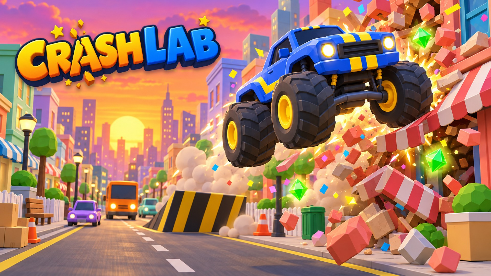
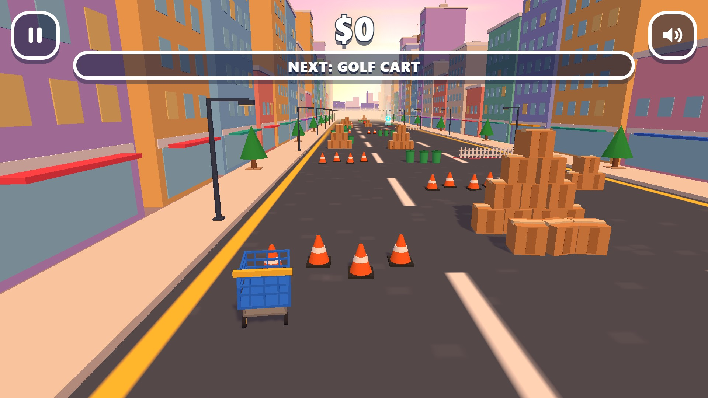
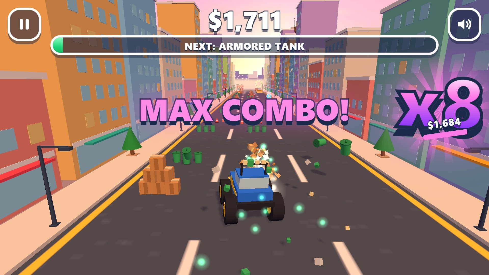
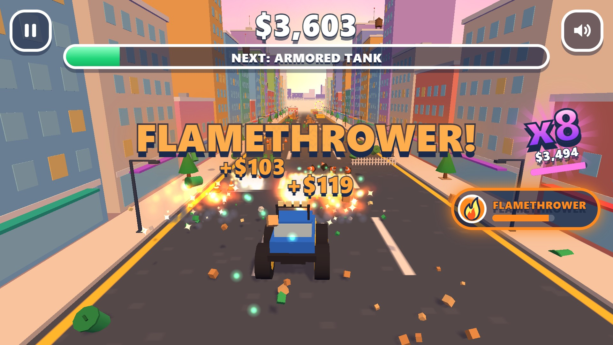
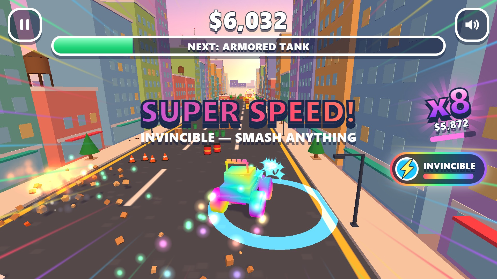
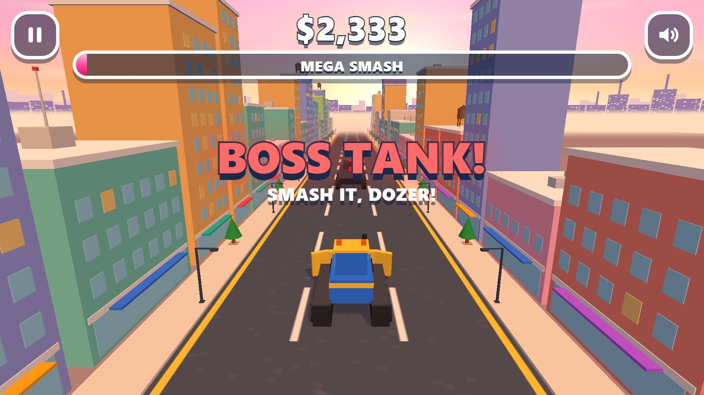
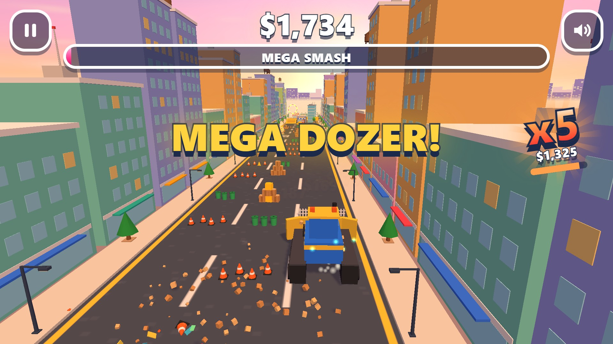
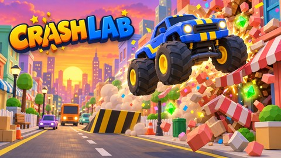
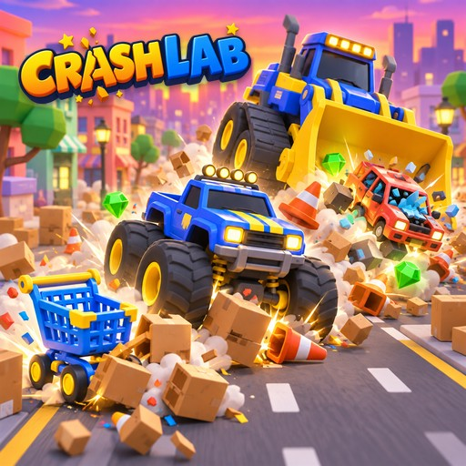
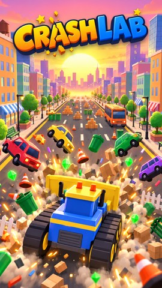

# Crash Lab — promo kit

**Smash the city. Collect scrap. Evolve your ride.**

[▶ Play Crash Lab](https://libodev.github.io/KiroCrashers3d/) · [Source and setup](README.md)

Start in a shopping cart and smash your way through a bright toy city. Collect scrap to upgrade through seven vehicles, chain hits into bigger combos, grab powerups, and bring the mega dozer to the final boss fight.

## Gameplay screenshots

These are captures from the game, shown in play order.

| First smash | Monster truck combo |
| :---: | :---: |
|  |  |

| Flamethrower powerup | Invincibility |
| :---: | :---: |
|  |  |

| Boss showdown | Mega dozer |
| :---: | :---: |
|  |  |

## Cover art and banners

| Wide banner | Square cover | Portrait cover |
| :---: | :---: | :---: |
|  |  |  |

The [marketing asset folder](marketing/dist/) has additional banner sizes, icons, logos, key art, and phone and tablet screenshots. Cover art is promotional illustration; the gameplay screenshots above are real captures.
