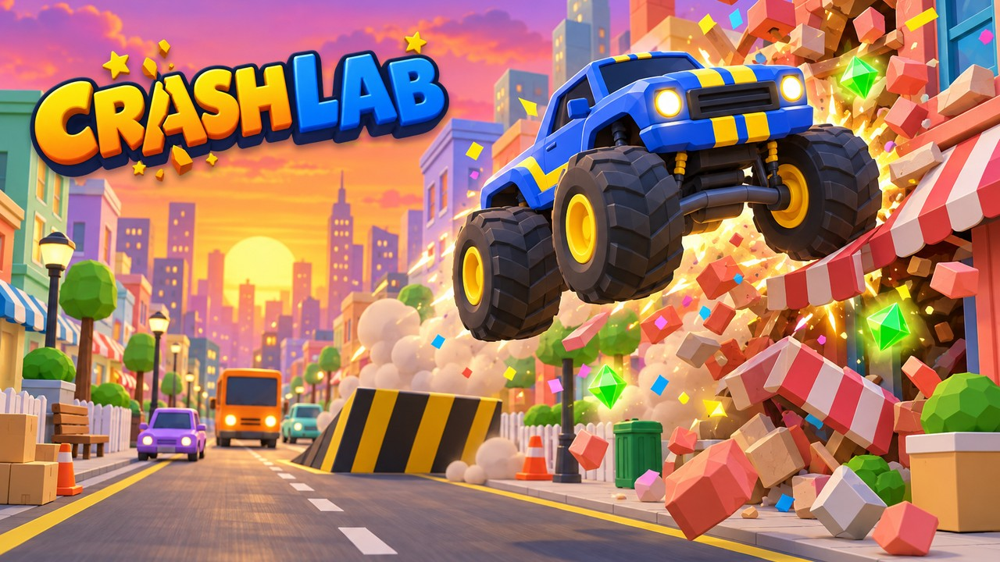

# Crash Lab



**Smash the city. Collect scrap. Evolve your ride.** Crash Lab is a colorful 3D arcade game that takes you from a shopping cart to a mega dozer, with a boss tank waiting at the end.

[Play the game](https://libodev.github.io/CrashLabs3D/) · [See screenshots and promo art](PROMO.md)

Steer with **A/D** or **←/→** on a keyboard. On a touch screen or with a mouse, press and drag to steer. Press **Space**, **Enter**, or tap to start.

## Run locally

```sh
npm ci
npm run dev
```

Run `npm run build` to make the web and itch.io site in `dist/`. Zip the *contents* of `dist/` for itch.io, with `index.html` at the archive root. The `main` branch deploys the web build to GitHub Pages through [the Pages workflow](.github/workflows/pages.yml).

Run `npm run build:playables` to make the YouTube Playables version in `dist-playables/`. Only that build loads the YouTube SDK; loading it on itch.io can incorrectly mute the game.

Built with TypeScript, Three.js, and Vite. The game also supports the YouTube Playables environment.
